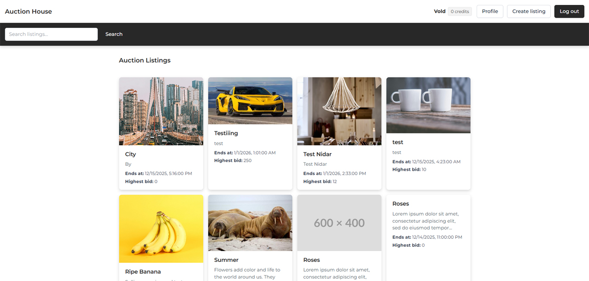

<p>
  
</p>

# Noroff Auction House

A responsive front-end auction website built as part of the **Front-end Development Semester Project 2** at Noroff.

The application allows users to browse auction listings, place bids, create their own listings, and manage their profile. Authentication, listings, and bidding functionality are handled through the Noroff Auction API.

---

## Getting Started

### Install dependencies

```bash
npm install
```

### Run Tailwind in development mode

```bash
npm run dev
```

---

## Technologies used

- **HTML5**
- **CSS3**
- **Tailwind CSS**
- **JavaScript (ES Modules)**
- **Noroff Auction API**
- **Node.js & npm**

---

## Folder Structure

```bash
semester-exam-fed2/
├── css/
│ ├── input.css
│ └── style.css
│
├── js/
│ ├── utils/
│ │ ├── header.js
│ │ └── toast.js
│ ├── index.js
│ ├── listing.js
│ ├── create-listing.js
│ ├── profile.js
│ ├── login.js
│ └── register.js
│
├── index.html
├── listing.html
├── create-listing.html
├── profile.html
├── login.html
├── register.html
│
├── package.json
├── package-lock.json
└── README.md
```

---

## Features

- User registration and login
- Browse and search auction listings
- View listing details and bid history
- Place bids on active listings
- Create new auction listings
- Edit user profile (avatar, banner, bio)
- Responsive layout for mobile and desktop
- Toast notifications for user feedback
- Focus on accessibility and clear navigation

---

## API

This project uses the Noroff Auction API for:

-Authentication
-User profiles
-Listings
-Bidding

All data is handled through API requests, and user sessions are managed using tokens stored in localStorage.

# Author

Arnt Helge Vold
Vold-Art @ GitHub
FED2 | Noroff
